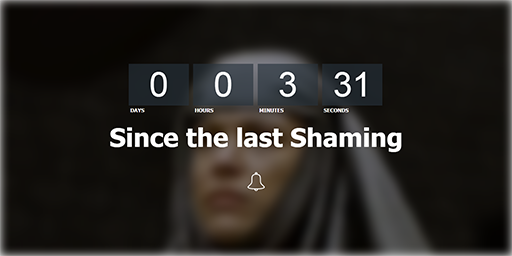

# Shame-Clock 

The Shame Clock is an excellent way to keep track of how long you, or anyone else, has gone without doing something shameful.
If someone has done something shameful simply click the bell to reset the clock and to audibly alert near by individuals of the shameful event. [Start Shaming!](http://thedillonb.github.io/Shame-Clock)

